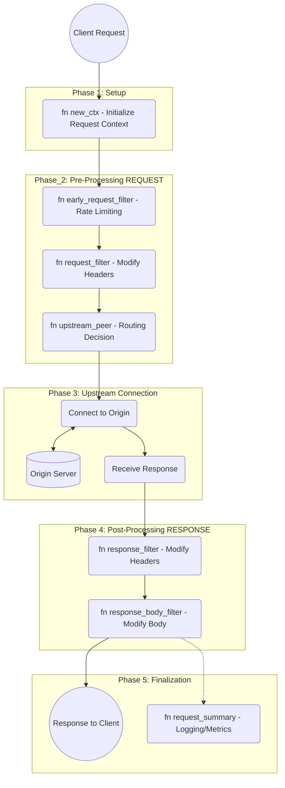

    In the Pingora framework, the request_summary() phase is a critical post-execution hook. Even though it appears at the end of the diagram, it serves as the primary "brain" for observability.

Here is a breakdown of how it works:
1. Timing of Execution

Unlike the filters that process the request or response headers, request_summary() runs after the entire request-response cycle is complete. This means it has access to the full story of the transaction, including whether the client disconnected early or if the upstream timed out.
2. Access to Context (ctx)

Since you mentioned wanting to write variables for future references, this is where those variables often "pay off":

    Data Retrieval: Any custom data you stored in the request context (ctx) during the new_ctx() or request_filter() phases can be read here.

    State Analysis: You can compare your initial variables against the final outcome to calculate custom logic.

3. Key Responsibilities

The request_summary() hook is typically used for:

    Logging: Writing to access logs (e.g., Nginx-style logs) with the final status code, bytes sent, and upstream latency.

    Metrics: Sending data to systems like Prometheus or StatsD. Because Pingora is multi-threaded and high-performance, this hook is designed to handle high-frequency data collection without slowing down the active request.

    Error Analysis: If a request failed during the upstream_peer() or response_filter() stages, the summary hook inspects the error types to help you debug whether the issue was the network, the origin server, or Pingora itself.

4. Technical Nature

In Rust, this is a method within the ProxyHttp trait. It receives a reference to the session and the context:
```Rust

fn request_summary(&self, _session: &mut Session, _ctx: &mut Self::CTX) {
    // Your logging/metrics logic here
}
```

By separating this from the response_filter(), Pingora ensures that even if the client experiences a fast response, the "paperwork" (logging) doesn't block the next request from starting.
